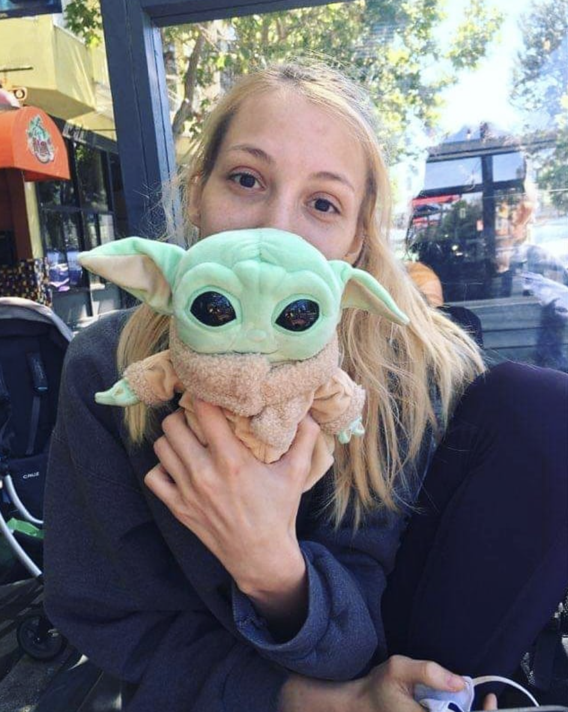

# Milena Rmus

I am a second-year PhD student @ UC Berkeley (Computational Cognitive Neuroscience Lab), working with Dr. Anne Collins. I study learning and decision-making using (mainly reinforcement learning) computational models. 

## Education 
ScB Cognitive Neuroscience, Brown University (Class of 2018) 

## Research Experience 
Research Specialist, Princeton University (2018-2019)

## Publications

Rmus, M., McDougle, S.D., Collins, A.G.E. (2020). The Role of Executive Function in Shaping
Reinforcement Learning. Current Opinions In Behavioral Sciences. [PDF](https://ccn.berkeley.edu/pdfs/papers/EFshapesRL2020_R1.pdf)

Rmus M., & Collins, A.G.E. (2020). What is a Choice in Reinforcement Learning? In
Proceedings of the 42nd Annual Meeting of the Cognitive Science Society. [PDF](https://cogsci.mindmodeling.org/2020/papers/0629/0629.pdf)

Thornton, M.A., Rmus, M., & Tamir, D. (2020). People learn mental state concepts from mental
state dynamics. (Under revision). [PDF](https://psyarxiv.com/kbcsj)

Rmus, M., Ritz, H., Hunter, L.E., Bornstein, A.M., Shenhav, A. (2019). Individual differences in
model-based planning are linked to the ability to rapidly acquire latent associative structure. (Under revision). [PDF](https://www.biorxiv.org/content/biorxiv/early/2019/08/02/723072.full.pdf)

## Get in touch! 
email: milena_rmus@berkeley.edu

[Twitter](https://twitter.com/milenamr7)

